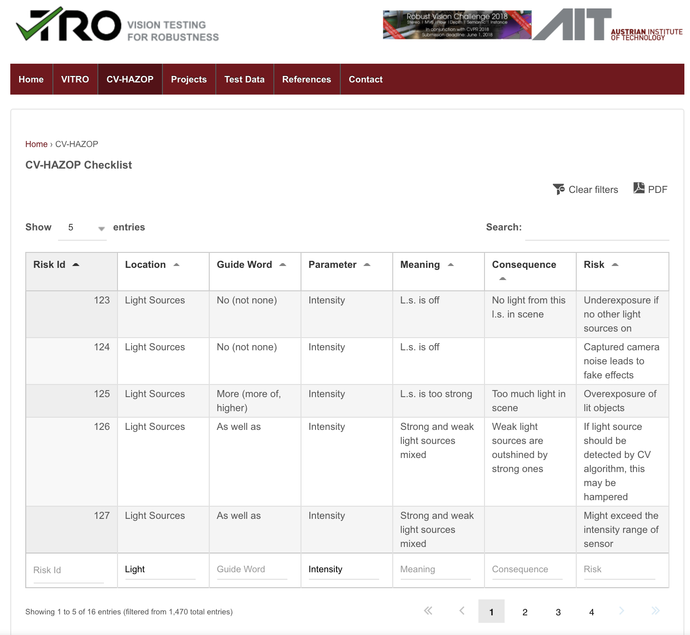

# Tackling the Unspecifiable: Reliability Requirements for Machine-learned Perception based on Human Performance
This repository contains method implementation and supplementary materials for our submission "Tackling the Unspecifiable: Reliability Requirements for Machine-learned Perception based on Human Performance" and contains three parts. First the two parts include our implementation of the proposed automated method and instructions on how to run them. The third part is the supplementary material of the complete list of safety-related CV-HAZOP entries and the list of the ones applicable to our approach; plus extended experiment results from the paper.

## 1. Estimating parameters
Our estimation scripts are in automating_requirements/estimating/

> **_NOTE:_** automating_requirements/estimating/image_maniputation.py is originally from https://github.com/rgeirhos/generalisation-humans-DNNs/blob/master/code/image_manipulation.py. We made minor changes to adapt it to our scripts. 

To run parameter estimation in our paper, follow these steps to set up:

1. Clone this repo if you haven't done so
>**Note:** To reproduce the results shown in the paper, steps 2, 4, 5 can be skipped since we also provided our pre-compiled file automating_requirements/estimating/all_filename_to_IQA.pkl 
2. Download ILSVRC2012 training set from http://www.image-net.org/challenges/LSVRC/2012/
3. Download experiment results for the five transformations used in the paper (contrast, noise, highpass, lowpass, phase noise) from https://github.com/rgeirhos/generalisation-humans-DNNs/tree/master/raw-data/humans. Create a directory in automating_requirements/estimating/ and name it csv_files/, then put the files in automating_requirements/estimating/csv_files/.
4. Download VSNR, VIF and CW-SSIM implementations from Chandler et al., Sheikh et al. and Sampat et al.
5. Run get_IQA.py with `python3 get_IQA.py --VIF_PATH VIF_PATH --CW_SSIM_PATH CW_SSIM_PATH --matlabPyrTools_PATH matlabPyrTools_PATH` to obtain the image pair to visual_change score mapping 

5. In the directory automating_requirements/estimating/, run `python3 collect_results.py -c class` to obtain the parameters for one specific class.

## 2. Verifying ML models with our reliability requirements
Our testing script is automating_requirements/verifying/automated_bootstrap.py
Run `python3 automated_bootstrap.py -h` to see instructions for input arguments.

To run the evaluation in the paper, follow these steps to set up:
1. Clone this repo if you haven't done so
2. Download MSCOCO_to_ImageNet_category_mapping.txt from https://github.com/rgeirhos/generalisation-humans-DNNs/blob/master/16-class-ImageNet/MSCOCO_to_ImageNet_category_mapping.txt, put this file in automating_requirements/verifying/ of your local copy of this repository.
3. Download synset_words.txt from https://github.com/HoldenCaulfieldRye/caffe/blob/master/data/ilsvrc12/synset_words.txt, put this file in automating_requirements/verifying/ of your local copy of this repository.
>**Note:** In the directory automating_requirements/verifying/ we also provide bootstrapping and detection result files from the experiments conducted for the evaluation section in the paper. Simply complete steps 1-3 from above and then run `python3 automated_bootstrap.py --load_existing -t TRANSFORMATION` to reproduce the results of our evaluation experiments for one specific transformation. 
4. Install Darknet following instructions here: https://pjreddie.com/darknet/install/
5. Obtain ILSVRC2012 validation images following the instructions in the "Validating On ImageNet" section here: https://pjreddie.com/darknet/imagenet/. Make sure that this file inet.val.list is generated and copy it to verifying/. 
6. From the same page as 4, download the pretrained weights for AlexNet, VGG-16, Darknet19, Darknet53 448x448, Resnet 50 and ResNeXt 50. Put all the weights in the darknet directory.

To re-run bootstrapping, complete all the steps then run `python3 automated_bootstrap.txt -d path_to_darknet -i path_to_inet.val.list -n number_of_batches -s number_of_images_per_batch -t transformation`. 

## 3. Supplementary materials
### 3.1 CV-HAZOP entries 
> **_NOTE:_** The complete CV-HAZOP checklist can be found: https://vitro-testing.com/cv-hazop/

Here we show our identified relevant and applicable CV-HAZOP entries. We provide the entry numbers, to see the details of each entry, please refer to the original CV-HAZOP check list with the link above.

In our annotated version of CV-HAZOP checklist, which is included in this repo, entries that are annotated as yellow are considered not related to image transformations and entries that are annotated as blue are not applicable to our approach.

1. Relevant entries for identifying safety-related image transformations are the entries that are not yellow.
2. Applicable entries for our method are the entries that are neither yellow nor blue.

To determine whether an image transformation is safety-related and whether it is applicable to our approach. Follow the following steps:
1. Identify the location on the perception pipeline that the transformation is affecting. For example, intensity shift affects light sources.
2. Then identify the parameter of that the transformation is changing. For example, intensity shift changes the intensity.
3. Filter the CV-HAZOP entries with the known location and parameter on their website:https://vitro-testing.com/cv-hazop/ 
For example, this is what we would see if we filter entries for light sources and intensity. 

4. Filter more by checking possible guide word or consequence to locate the exact entry. 
5. To see whether the found entry is applicable to our approach, check if it is annotated with color in our annotated version of CV-HAZOP checklist.

### 3.1 Extended experiment results from Evaluation
> **_NOTE:_** All images are taken from ILSVRC2012 validation set, all models are retrieved from http://pjreddie.com/darknet/
1. Testing on 150 car images and 500 random images from other classes. 200 batches of 200 images are sampled during bootstrap.
Since for bootstrapping, the number of batches is considered enough if we change the random seed and see similar results, we first demonstrate that 200 batches of images are enough batches through two runs with different random seeds.

    Verifying whether darknet 19 satisfies our requirements for recognizing cars with the transformation intensity_shift:

    Verifying accuracy-preserving: 
    |       | Estimated mean      | Estimated standard deviation  |
    | ----------- | ----------- | ----------- |
    | first run      | 0.92      | 0.016       |
    | second run   | 0.92   | 0.017        |

    Verifying prediction-preserving:
    |       | Estimated mean      | Estimated standard deviation |
    | ----------- | ----------- | ----------- |
    | first run      | 0.973      | 0.010       |
    | second run   | 0.977   | 0.010        |

As shown in the above tables, we see very similar results for verifying both requirements. Thus, though it may not be the smallest number of batches needed, 200 batches are considered enough samples.

2. Due to the space limit, here we show the esimated mean and standard deviation for the experiment results included in the paper. For verifying **accuracy-preservation** requirement, we are estimating the _accuracy_ of an ML model on the test images generated through bootstrapping.  For verifying **prediction-preservation** requirement, we are estimating the _percentage of labels preserved_ of an ML model on the test images generated through bootstrapping.

    - Contrast adjustment
        - Verifying **accuracy-preservation** 

            |model| mean | standard deviation| confidence of satisfaction  | 
            |-----|----|------|-----------|
            |  Alexnet   | 0.882|0.021|  0.054 |
            | Darknet19 | 0.912 | 0.018 | 0.142|
            | Darknet53_448 | 0.943 | 0.015 | 0.446  |
            | ResNet50 | 0.933 | 0.016 | 0.125 |
            |ResNext50 |  0.942 | 0.015 | 0.277 |
            | VGG-16 | 0.931 | 0.016 | 0.246 |

        - Verifying **prediction-preservation** 

            |model| mean | standard deviation| confidence of satisfaction  | 
            |-----|----|------|-----------|
            |  Alexnet   | 0.958 | 0.013 | 0.001 |
            | Darknet19 | 0.973 | 0.011 | 0.007|
            | Darknet53_448 | 0.987 | 0.007 | 0.035  |
            | ResNet50 | 0.976 | 0.01 | 0.007 |
            |ResNext50 |  0.986 | 0.007 | 0.028 |
            | VGG-16 | 0.978 | 0.01 | 0.011 |

    - Uniform noise
        - Verifying **accuracy-preservation** 

            |model| mean | standard deviation| confidence of satisfaction  | 
            |-----|----|------|-----------|
            |  Alexnet   | 0.867 | 0.02 | 0.01 |
            | Darknet19 | 0.904 | 0.019 | 0.083 |
            | Darknet53_448 | 0.939 | 0.015 | 0.343  |
            | ResNet50 | 0.926 | 0.016 | 0.058 |
            |ResNext50 |  0.932 | 0.016 | 0.117 |
            | VGG-16 | 0.903 | 0.018 | 0.019 |

        - Verifying **prediction-preservation** 

            |model| mean | standard deviation| confidence of satisfaction  | 
            |-----|----|------|-----------|
            |  Alexnet   | 0.95 | 0.014 | 0.0  |
            | Darknet19 | 0.963 | 0.012 | 0.001|
            | Darknet53_448 | 0.976 | 0.01 | 0.008  |
            | ResNet50 | 0.97 | 0.011 | 0.004 |
            |ResNext50 |  0.97 | 0.011 | 0.003 |
            | VGG-16 | 0.952 | 0.014 | 0.0 |
    - High-pass filter
        - Verifying **accuracy-preservation** 

            |model| mean | standard deviation| confidence of satisfaction  | 
            |-----|----|------|-----------|
            |  Alexnet   | 0.894 | 0.019 | 0.169 |
            | Darknet19 | 0.922 | 0.018 | 0.352 |
            | Darknet53_448 | 0.94 | 0.014 | 0.416  |
            | ResNet50 | 0.937 | 0.014 | 0.18 |
            |ResNext50 |  0.948 | 0.014 | 0.41 |
            | VGG-16 |  0.929 | 0.015 | 0.23 |

        - Verifying **prediction-preservation** 

            |model| mean | standard deviation| confidence of satisfaction  | 
            |-----|----|------|-----------|
            |  Alexnet   | 0.971 | 0.01 | 0.003  |
            | Darknet19 | 0.977 | 0.01 | 0.01|
            | Darknet53_448 | 0.984 | 0.008 | 0.021  |
            | ResNet50 | 0.979 | 0.009 | 0.01|
            |ResNext50 |  0.982 | 0.009 | 0.021 |
            | VGG-16 | 0.979 | 0.01 | 0.015 |
    - Low-pass filter
        - Verifying **accuracy-preservation** 

            |model| mean | standard deviation| confidence of satisfaction  | 
            |-----|----|------|-----------|
            |  Alexnet   | 0.86 | 0.021 | 0.005 |
            | Darknet19 | 0.877 | 0.02 | 0.005 |
            | Darknet53_448 | 0.916 | 0.019 | 0.087  |
            | ResNet50 | 0.917 | 0.018 | 0.044 |
            |ResNext50 |  0.918 | 0.018 | 0.051 |
            | VGG-16 |  0.91 | 0.019 | 0.085 |

        - Verifying **prediction-preservation** 

            |model| mean | standard deviation| confidence of satisfaction  | 
            |-----|----|------|-----------|
            |  Alexnet   | 0.936 | 0.016 | 0.0  |
            | Darknet19 | 0.937 | 0.016 | 0.0|
            | Darknet53_448 | 0.955 | 0.014 | 0.001 |
            | ResNet50 | 0.962 | 0.012 | 0.001|
            |ResNext50 |  0.955 | 0.015 | 0.001 |
            | VGG-16 | 0.95 | 0.014 | 0.0 |
    - Phase noise
        - Verifying **accuracy-preservation** 

            |model| mean | standard deviation| confidence of satisfaction  | 
            |-----|----|------|-----------|
            |  Alexnet   | 0.824 | 0.022 | 0.0 |
            | Darknet19 | 0.839 | 0.021 | 0.0 |
            | Darknet53_448 | 0.873 | 0.019 | 0.0 |
            | ResNet50 | 0.871 | 0.021 | 0.0 |
            |ResNext50 |  0.877 | 0.019 | 0.0 |
            | VGG-16 |  0.845 | 0.021 | 0.0 |

        - Verifying **prediction-preservation** 

            |model| mean | standard deviation| confidence of satisfaction  | 
            |-----|----|------|-----------|
            |  Alexnet   | 0.902 | 0.018 | 0.0  |
            | Darknet19 |  0.895 | 0.018 | 0.0|
            | Darknet53_448 | 0.923 | 0.017 | 0.0 |
            | ResNet50 | 0.912 | 0.019 | 0.0|
            |ResNext50 |  0.917 | 0.017 | 0.0 |
            | VGG-16 | 0.889 | 0.02 | 0.0 |
    - Intensity shift

        - Verifying **accuracy-preservation** 

            |model| mean | standard deviation| confidence of satisfaction  | 
            |-----|----|------|-----------|
            |  Alexnet   | 0.897|0.017|  0.141 |
            | Darknet19 | 0.92 | 0.016 | 0.251 |
            | Darknet53_448 | 0.94 | 0.014 | 0.367 |
            | ResNet50 | 0.936 | 0.016 | 0.18 |
            |ResNext50 | 0.94 | 0.014 | 0.22 |
            | VGG-16 | 0.929 | 0.016 | 0.215 |

        - Verifying **prediction-preservation** 

            |model| mean | standard deviation| confidence of satisfaction  | 
            |-----|----|------|-----------|
            |  Alexnet   | 0.973 | 0.01 | 0.004|
            | Darknet19 | 0.978 | 0.01 | 0.013 |
            | Darknet53_448 | 0.988 | 0.007 | 0.046  |
            | ResNet50 | 0.978 | 0.01 | 0.019 |
            |ResNext50 | 0.983 | 0.008 | 0.023 |
            | VGG-16 | 0.977 | 0.01 | 0.01 |

    - Gaussian noise

        - Verifying **accuracy-preservation** 

            |model| mean | standard deviation| confidence of satisfaction  | 
            |-----|----|------|-----------|
            |  Alexnet   | 0.866 | 0.02 | 0.007 |
            | Darknet19 | 0.906 | 0.019 | 0.095|
            | Darknet53_448 | 0.941 | 0.014 | 0.391 |
            | ResNet50 | 0.931 | 0.015 | 0.094  |
            |ResNext50 | 0.934 | 0.014 | 0.125  |
            | VGG-16 | 0.906 | 0.017 | 0.019|

        - Verifying **prediction-preservation** 

            |model| mean | standard deviation| confidence of satisfaction  | 
            |-----|----|------|-----------|
            |  Alexnet   | 0.949 | 0.014 | 0.0|
            | Darknet19 | 0.968 | 0.012 | 0.006  |
            | Darknet53_448 | 0.976 | 0.01 | 0.007 |
            | Resnet50 |0.969 | 0.01 | 0.002  |
            |Resnext50 | 0.973 | 0.01 | 0.004|
            | VGG-16 | 0.955 | 0.013 | 0.0 |
    
    - Gamma adjustment
        
         - Verifying **accuracy-preservation** 
         
            |model| mean | standard deviation| confidence of satisfaction  | 
            |-----|----|------|-----------|
            |  Alexnet   | 0.911 | 0.016 | 0.402 |
            | Darknet19 | 0.931 | 0.015 | 0.511|
            | Darknet53_448 | 0.946 | 0.013 | 0.557 |
            | ResNet50 | 0.951 | 0.013 | 0.5  |
            |ResNext50 | 0.949 | 0.013 | 0.447  |
            | VGG-16 | 0.94 | 0.015 | 0.459 |

        - Verifying **prediction-preservation** 
        
            |model| mean | standard deviation| confidence of satisfaction  | 
            |-----|----|------|-----------|
            |  Alexnet   | 0.992 | 0.006 | 0.075|
            | Darknet19 | 0.993 | 0.005 | 0.096   |
            | Darknet53_448 | 0.994 | 0.005 | 0.098 |
            | ResNet50 |0.991 | 0.006 | 0.068  |
            |ResNext50 | 0.993 | 0.006 | 0.101|
            | VGG-16 | 0.992 | 0.006 | 0.091 |

        
    
