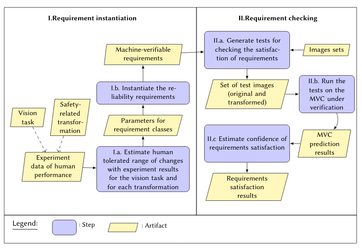

**************************************************************
Overview of our requirement instantiation and checking methods
**************************************************************

In this website, we provide the supplementary material for our ICSE'2022 paper.

Please find in the figure below an overview of the approach that we propose and a summary that is linked to the supplementary material sections.  

Given (i) a vision task for the MVC, (ii) a safety-related transformation (see :ref:`transformation`) and (iii) experimental data for estimating the ranges of visual changes that do not affect human performance, we provide a process for instantiating machine-verifiable reliability requirements for MVC (see :ref:`estimating`) and a process for checking whether an MVC satisfies these instantiated requirements (see :ref:`checking`).

