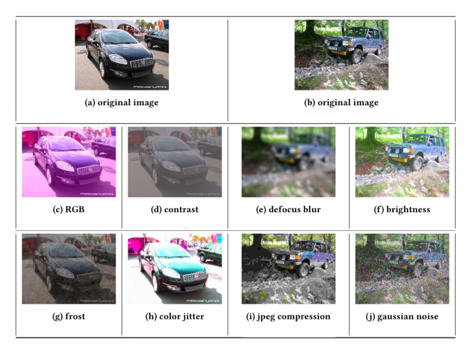

###############################
Obtaining Human Experiment Data
###############################

In this page we present the settings, implementation and results of the image classification experiments with human participants that we conducted.
We followed the same experiment procedure as Geirhos et al [Geirhos-et-al-18]_.
To make sure that the participants understand the task, we included qualification tests and sanity checks.
We only considered results from those that passed both.
In this experiment, we used images from the ILSRVR 2012 training dataset [ILSVRC2012]_ and considered a binary classification problem of recognizing car instances.
To differentiate between car and non-car instances, we adopted the `class hierarchy <https://observablehq.com/@mbostock/imagenet-hierarchy>`_ provided by the ILSVRC2012 dataset .
In our experiment, we selected one transformation for each CV-Hazop entry, which corresponds to 8 safety-related transformations: RGB, contrast, defocus blur, brightness, frost, color jitter, jpeg compression, and gaussian noise.

8 transformations included in our experiments
"""""""""""""""""""""""""""""""""""""""""""""

For each of the 8 transformations, we sampled uniformly 1000 transformation magnitudes
and measured the performance of 5 human participants per each transformation level.
To achieve this, we divided the 1000 magnitudes * 8 transformations into batches of 20 images.
Each batch is shown 5 times to different participants using the platform Amazon Mechanical Turk.
As a result, for image classification, we collected 40000 human performance results.

Find `here <_static/full-recog-fix.html>`_ the implementations which enabled us to measure human performance on the platform Amazon Mechanical Turk.

The code of experiment is based on the code shared by Dr. Dimitrios Papadopoulos [Papadopoulos-et-al-17]_, we would like to thank Dr. Papadopoulos for sharing his experiment implementation with us.

.. [Geirhos-et-al-18]

   Author: R. Geirhos and others
   
   Title: Generalisation in humans and deep neural networks
   
   Year: 2018
   

.. [ILSVRC2012]

   Author: O. Russakovsky and others
   
   Title: ImageNet Large Scale Visual Recognition Challenge
   
   Year: 2015 
   
   Link: `ILSVRC2012 website <https://image-net.org/challenges/LSVRC/2012/>`_
   
   
.. [Papadopoulos-et-al-17]

   Author: D. Papadopoulosand others
   
   Title: Training Object Class Detectors with Click Supervision
   
   Year: 2017 
